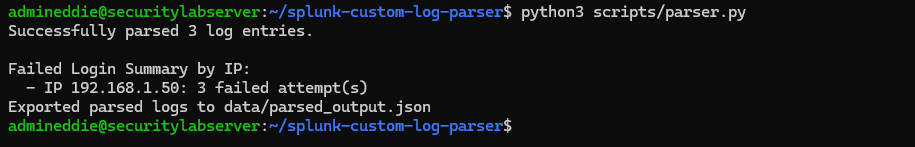

# Home Lab Project: Custom Log Parsing, Version Control, and Splunk Ingestion Workflow

## Repository Structure

```text
splunk-custom-log-parser/
├── assets/
│   └── execution.png           # CLI execution & output verification screenshot
├── configs/
│   ├── indexes.conf            # Custom index definition (security_lab_index)
│   └── inputs.conf             # Splunk input monitor and TCP receiver configuration
├── data/
│   └── parsed_output.json      # Structured JSON log output
├── sample_logs/
│   └── auth.log                # Raw sample authentication logs for parser input
├── scripts/
│   ├── log_generator.py        # Python script for generating test logs
│   └── parser.py               # Python script for parsing and formatting logs
├── .gitignore
└── README.md
```

## 1. Lab Overview & Architecture

- **Environment**: Ubuntu Server virtual machine running in a local VMware-based home lab environment.
- **Core Tools**: Splunk Enterprise, Splunk Universal Forwarder, Python scripting for log processing, Linux terminal utilities, Git, and GitHub.
- **Objective**: Establish a comprehensive hands-on IT and cybersecurity home lab to generate, parse, ingest, version control, and analyze structured security data. This project documents the complete end-to-end workflow from hypervisor clipboard troubleshooting to secure GitHub remote publishing and Splunk log monitoring.

## 2. Troubleshooting VM Clipboard Integration (Host-to-VM Copy/Paste)

### The Challenge

During the initial deployment of the Ubuntu Server virtual machine, standard clipboard integration between the host operating system and the guest VM was disabled by default. This restricted the ability to copy configuration blocks, scripts, and administrative commands directly from the host into the terminal.

### The Fix & Diagnostic Commands

1. Checked active system services and updated package lists:

```bash
sudo apt update
sudo systemctl status
```

2. Installed the appropriate virtualization guest integration packages within the Ubuntu Server terminal to restore bi-directional copy/paste and drag-and-drop capabilities:

```bash
sudo apt update && sudo apt install -y open-vm-tools open-vm-tools-desktop
```

3. Restarted the virtual machine services and verified active guest daemon status:

```bash
sudo systemctl restart open-vm-tools
sudo systemctl enable open-vm-tools
```

## 3. Data Parsing & Script Execution

### Log Preparation & Input Source

The parser reads raw authentication logs from `sample_logs/auth.log`, processes the telemetry, and structures it into a standardized JSON format (`data/parsed_output.json`) to ensure compatibility with Splunk's event parser. By converting raw strings into JSON before ingestion, we significantly reduce the processing overhead on the Splunk indexer.

### Implementation Script (`scripts/parser.py`)

Below is the core parsing logic used to read raw log lines, extract metrics like failed login attempts by source IP, and export the structured results:

```python
import os
import json
from collections import Counter

LOG_PATH = "sample_logs/auth.log"
OUTPUT_PATH = "data/parsed_output.json"

def parse_logs():
    if not os.path.exists(LOG_PATH):
        print(f"Error: The file {LOG_PATH} was not found.")
        return [], []

    failed_ips = []
    parsed_entries = []

    with open(LOG_PATH, "r") as f:
        for line in f:
            if "Failed password" in line:
                parts = line.strip().split()
                ip = "Unknown"
                for i, part in enumerate(parts):
                    if part == "from":
                        ip = parts[i+1]
                        break
                failed_ips.append(ip)
                parsed_entries.append({
                    "timestamp": " ".join(parts[:3]), 
                    "event": "Failed Login", 
                    "source_ip": ip
                })

    print(f"Successfully parsed {len(parsed_entries)} log entries.")
    return failed_ips, parsed_entries

def export_to_json(entries, output_path=OUTPUT_PATH):
    os.makedirs(os.path.dirname(output_path), exist_ok=True)
    with open(output_path, "w") as f:
        json.dump(entries, f, indent=4)
    print(f"Exported parsed logs to {output_path}")

if __name__ == "__main__":
    failures, entries = parse_logs()
    if failures:
        print("\nFailed Login Summary by IP:")
        for ip, count in Counter(failures).items():
            print(f"  - IP {ip}: {count} failed attempt(s)")
    if entries:
        export_to_json(entries)
```

## 4. Linux File Permissions & Directory Management

To ensure Splunk Enterprise (running under its dedicated service account) has proper read access to the generated logs without triggering permission errors or blocked ingestion streams, file access control lists and ownership were configured using the following terminal commands:

```bash
mkdir -p data/
sudo chown -R admineddie:splunk data/
sudo chmod 750 data/parsed_output.json
ls -la data/
```

## 5. Splunk Configuration & Data Ingestion Pipeline

### Data Receiver & Universal Forwarder Configuration

- **Receiver Setup (Port 9997)**: Configured Splunk Enterprise to listen on TCP port 9997 under `[splunktcp://9997]` in `inputs.conf` to receive forwarded data streams.
- **Management Port Resolution (Port 8090)**: Resolved a management port conflict with Splunk Enterprise (which binds to default port 8089) by reconfiguring the Splunk Universal Forwarder daemon to utilize port 8090.
- **Forwarding Rule**: Established active log forwarding from the Universal Forwarder (`127.0.0.1:9997`) to push local data streams into the Splunk Enterprise indexer.

### Data Input Setup & Parsing

- Configured file monitoring for the absolute log path: `data/parsed_output.json`.
- Assigned Sourcetype to `_json`. Splunk natively parses key-value pairs and arrays during indexing without requiring custom Regex extraction rules in `props.conf` or `transforms.conf`.
- Routed event streams directly to the designated custom index: `security_lab_index`.

## 6. Splunk Search & Analysis Validation

To verify the ingestion pipeline and test the newly extracted structured JSON fields, the following Splunk Processing Language (SPL) queries were executed in the Search & Reporting app:

```spl
# 1. Verify general ingestion and field extraction
index="security_lab_index" sourcetype="_json"

# 2. Table formatted fields extracted from JSON payload
index=security_lab_index | table _time source_ip event

# 3. Create a statistical timechart of events grouped by source IP
index="security_lab_index" sourcetype="_json" | timechart count by source_ip
```

## 7. Repository Structure & Version Control Setup Steps

### Repository Initialization and Remote Push Steps Performed

1. Created project directory layout:

```bash
mkdir -p ~/splunk-custom-log-parser/{scripts,configs,data,sample_logs,assets}
cd ~/splunk-custom-log-parser
git init
```

2. Staged and committed initial project files to local version control:

```bash
git add .
git commit -m "Initial commit of custom log parser lab workflow and configs"
```

3. Configured remote repository tracking and pushed to the main branch:

```bash
git remote add origin https://github.com/edwardmejia0524-Midnight/splunk-custom-log-parser.git
git branch -M main
git push -u origin main
```

### File & Directory Descriptions

| Path | Description |
|---|---|
| `assets/` | Contains CLI execution and output verification screenshots. |
| `configs/` | Contains Splunk `inputs.conf` and `indexes.conf` ingestion definitions. |
| `data/` | Contains structured JSON output files (`parsed_output.json`). |
| `sample_logs/` | Contains raw test input logs (`auth.log`) used for parser execution. |
| `scripts/` | Contains Python automation scripts (`log_generator.py`, `parser.py`). |
| `README.md` | Complete technical project documentation, architectural overview, and troubleshooting steps. |

## 8. Execution Output & Verification


